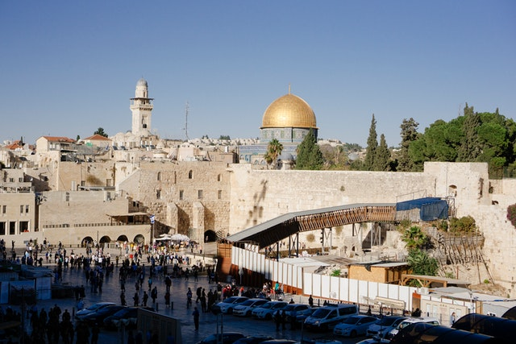

# isotope live https://jibon87.github.io/isotope/

```
isotop

1.  js--link ---> jquery.min.js

2.  js--link ---> js/bootstrap.min.js

3.  js--link ---> js/isotop.min.js

4.  css--link ---> css/bootstrap.min.css

5.  css--link ---> css/style.min.css [


                                    // isotop css

                                    .isotop-img-box img {
                                        width: 100%;
                                        height: 100%;
                                    }

                                    .button-group {
                                        padding: 0.625rem 0.9375rem;
                                        background-color: aqua;
                                        margin: 0.625rem auto;
                                        display: flex;
                                        justify-content: center;
                                        border-radius: 3.125rem;
                                    }

                                    .button-group button {
                                        border: none;
                                        text-align: center;
                                        padding: 0.625rem 1.25rem;
                                        margin: 0 0.3125rem;
                                        color: rgb(230, 230, 3);
                                        background-color: black;
                                        border-radius: 0.3125rem;
                                        transition: 0.3s linear;
                                    }

                                    button.active {
                                        background-color: rgb(3, 230, 3);
                                        color: black;
                                    }

                                    .button-group button:hover {
                                        background-color: rgb(230, 230, 3);
                                        color: black;
                                    }


]

6.  html 
    {
    
        <div class="container">
            <div class="row">
                <div class="button-group filter-button-group nav-list flex-md-row flex-column">
                    <button class="active" data-filter="*">show all</button>
                    <button data-filter=".flowers">flowers</button>
                    <button data-filter=".nature">nature</button>
                    <button data-filter=".motivation">motivation</button>
                    <button data-filter=".coding">coding</button>
                    <button data-filter=".islamic">islamic</button>
                </div>
            </div>
            <div class="row grid g-2 g-md-4">
                <!-- nature -->
                <div class="col-6 col-sm-4 grid-item nature">
                    <div class="isotop-img-box">
                        
                    </div>
                </div>
                <div class="col-6 col-sm-4 grid-item nature">
                    <div class="isotop-img-box">
                        
                    </div>
                </div>
                <div class="col-6 col-sm-4 grid-item nature">
                    <div class="isotop-img-box">
                        
                    </div>
                </div>
                <div class="col-6 col-sm-4 grid-item nature">
                    <div class="isotop-img-box">
                        
                    </div>
                </div>
                <div class="col-6 col-sm-4 grid-item nature">
                    <div class="isotop-img-box">
                        
                    </div>
                </div>
                <!-- motivation -->
                <div class="col-6 col-sm-4 grid-item motivation">
                    <div class="isotop-img-box">
                        
                    </div>
                </div>
                <div class="col-6 col-sm-4 grid-item motivation">
                    <div class="isotop-img-box">
                        
                    </div>
                </div>
                <div class="col-6 col-sm-4 grid-item motivation">
                    <div class="isotop-img-box">
                        
                    </div>
                </div>
                <div class="col-6 col-sm-4 grid-item motivation">
                    <div class="isotop-img-box">
                        
                    </div>
                </div>
                <!-- islamic -->
                <div class="col-6 col-sm-4 grid-item islamic">
                    <div class="isotop-img-box">
                        
                    </div>
                </div>
                <div class="col-6 col-sm-4 grid-item islamic">
                    <div class="isotop-img-box">
                        
                    </div>
                </div>
                <!-- flowers -->
                <div class="col-6 col-sm-4 grid-item flowers">
                    <div class="isotop-img-box">
                        
                    </div>
                </div>
                <!-- coding -->
                <div class="col-6 col-sm-4 grid-item coding">
                    <div class="isotop-img-box">
                        
                    </div>
                </div>
                <div class="col-6 col-sm-4 grid-item coding">
                    <div class="isotop-img-box">
                        
                    </div>
                </div>
                <div class="col-6 col-sm-4 grid-item coding">
                    <div class="isotop-img-box">
                        
                    </div>
                </div>
            </div>
        </div>

    }
    
7.  active js {

    // isotope
    var grid = $(".grid").isotope({
        itemSelector: ".grid-item",
        percentPosition: true,
    });
    // filter items on button click
    $(".filter-button-group").on("click", "button", function () {
        var filterValue = $(this).attr("data-filter");
        grid.isotope({ filter: filterValue });
    });
    //active
    $(".nav-list button").click(function () {
        $(".nav-list button.active").removeClass("active");
        $(this).addClass("active");
    });


}
8.  note [ 
           <button data-filter=".islamic">islamic</button>

           <div class="col-6 col-sm-4 grid-item islamic">
                <div class="isotop-img-box">
                    
                </div>
            </div>

            * islamic *
         ]
